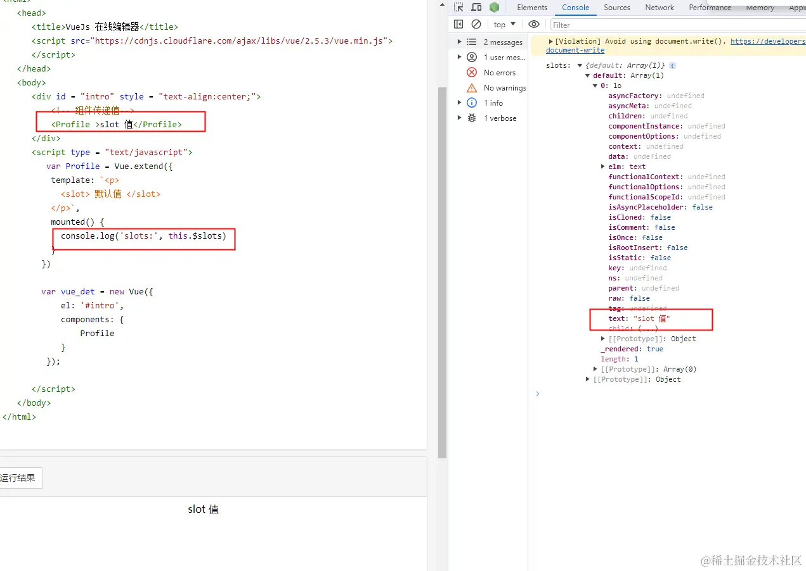

# Vue.extend

Vue.extend 是 Vue.js 中的一个静态方法，用于创建一个新的组件构造函数。这个方法允许开发者基于现有的 Vue 构造函数（通常是根 Vue 实例或其他组件）来扩展和创建新的组件。

1. 创建子组件构造函数
   Vue.extend 允许您定义一个新的组件构造函数，该构造函数可以包含特定的选项，如 data、methods、computed、props 和 template 等。
2. 选项合并
   当您使用 Vue.extend 创建一个新组件时，您可以传入一个选项对象。这个选项对象会与父类（超类）的选项进行合并。这样，子组件可以继承父组件的选项，同时添加或覆盖特定的选项。
3. 组件的复用
   通过 Vue.extend 创建的组件构造函数可以被多次实例化，从而实现组件的复用。每次实例化都会创建一个新的组件实例，具有独立的状态和行为。
4. 支持继承
   Vue.extend 支持组件的继承，使得开发者可以创建复杂的组件层次结构。子组件可以继承父组件的功能，并在此基础上进行扩展。
5. 递归组件
   Vue.extend 还可以用于创建递归组件。通过自注册机制，组件可以在其自身的模板中引用自己，从而实现递归结构。

```js
/**
 * Class inheritance
 * @description 用于创建一个新的组件构造函数（子类），并将其与父类（超类）进行关联
 */
Vue.extend = function (extendOptions) {
  extendOptions = extendOptions || {};
  var Super = this; // 当前构造函数，即 Vue
  var SuperId = Super.cid; // 获取超类的唯一标识符
  // 用于存储已创建的构造函数，以避免重复创建
  var cachedCtors = extendOptions._Ctor || (extendOptions._Ctor = {});
  // 如果缓存中已经存在该构造函数，则直接返回缓存的构造函数，避免重复创建
  if (cachedCtors[SuperId]) {
    return cachedCtors[SuperId]
  }

  // 获取组件名称，如果没有提供，则使用超类的名称
  var name = extendOptions.name || Super.options.name;
  if (process.env.NODE_ENV !== 'production' && name) {
    validateComponentName(name);
  }

  // 创建子类构造函数
  var Sub = function VueComponent (options) {
    this._init(options);
  };
  // 将子类的原型设置为超类的原型，以实现继承
  Sub.prototype = Object.create(Super.prototype);
  Sub.prototype.constructor = Sub;
  Sub.cid = cid++; // 为子类分配一个唯一的标识符
  // 合并超类的选项和扩展选项，生成子类的选项
  Sub.options = mergeOptions(
    Super.options,
    extendOptions
  );
  // 保存对超类的引用
  Sub['super'] = Super;

  // For props and computed properties, we define the proxy getters on
  // the Vue instances at extension time, on the extended prototype. This
  // avoids Object.defineProperty calls for each instance created.
  // 初始化属性和计算属性
  if (Sub.options.props) {
    initProps$1(Sub);
  }
  if (Sub.options.computed) {
    initComputed$1(Sub);
  }

  // allow further extension/mixin/plugin usage
  // 允许子类使用超类的方法，如 extend、mixin 和 use
  Sub.extend = Super.extend;
  Sub.mixin = Super.mixin;
  Sub.use = Super.use;

  // create asset registers, so extended classes
  // can have their private assets too.
  // 将超类的资产类型（如组件、指令等）复制到子类中，以便子类可以拥有自己的私有资产
  ASSET_TYPES.forEach(function (type) {
    Sub[type] = Super[type];
  });
  // enable recursive self-lookup
  // 如果有名称，则将子类注册到其选项的组件列表中，以便可以递归查找
  // [加深理解] 这里是让子组件构造函数 Sub 自己注册自己到其选项的 components 列表中
  // 这么做的一个好处是支持递归组件的实现
  // 假设我们要创建一个树形结构的组件，每个节点都可以有子节点。我们可以使用自注册的机制来实现这个功能。
  if (name) {
    Sub.options.components[name] = Sub;
  }

  // keep a reference to the super options at extension time.
  // later at instantiation we can check if Super's options have
  // been updated.
  // 保存超类的选项、扩展选项和密封选项，以便在实例化时检查超类的选项是否已更新
  Sub.superOptions = Super.options;
  Sub.extendOptions = extendOptions;
  Sub.sealedOptions = extend({}, Sub.options); // sealedOptions 通常是在组件构造时创建的一份选项快照

  // cache constructor
  // 将新创建的子类构造函数缓存，并返回该构造函数
  cachedCtors[SuperId] = Sub;
  return Sub
};
```

通过一个具体的例子来说明 Vue 中的自注册机制以及如何实现递归组件。
假设我们要创建一个树形结构的组件，每个节点都可以有子节点。我们可以使用自注册的机制来实现这个功能。

1. 定义递归组件

```js
const TreeNode = Vue.extend({
  name: 'TreeNode',
  props: {
    node: {
      type: Object,
      required: true
    }
  },
  template: `
    <div>
      <div>{{ node.name }}</div>
      <div v-if="node.children && node.children.length">
        <div v-for="(child, index) in node.children" :key="index">
          <!-- 自注册，引用自己 -->
          <tree-node :node="child"></tree-node>
        </div>
      </div>
    </div>
  `,
  components: {
    TreeNode // 自注册
  }
});
```

2. 使用递归组件
   接下来，我们可以在 Vue 实例中使用这个递归组件：

```js
new Vue({
  el: '#app',
  data() {
    return {
      treeData: {
        name: 'Root',
        children: [
          {
            name: 'Child 1',
            children: [
              { name: 'Grandchild 1-1' },
              { name: 'Grandchild 1-2' }
            ]
          },
          {
            name: 'Child 2',
            children: [
              { name: 'Grandchild 2-1' }
            ]
          }
        ]
      }
    };
  },
  template: `
    <div>
      <tree-node :node="treeData"></tree-node>
    </div>
  `,
  components: {
    TreeNode // 注册递归组件
  }
});
```

1、通过 propsData 想 vue.extend 创建的组件传值
2、vue.extend 创建的组件为什么通过 components 注册使用无法渲染
3、vue.extend 创建的组件如何使用 slot 
4、vue.extend 与 vue.component 的区别
5、如何通过 vue.extend 创建一个编程式的 modal 组件

+ 
